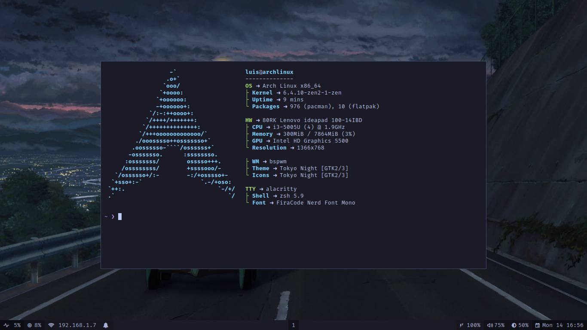

# README.md



This repository hosts my personal dotfiles configurations. Dotfiles are configuration files used to customize various tools and applications in my development environment. By sharing them here, I can maintain a backup and synchronization of my preferences across different systems.

Feel free to explore the different files and directories in this repository. Each one represents a specific configuration for a particular tool or application. You can use them as inspiration for your own setups or clone this repository and tailor it to your needs.

## Usage

To use my dotfiles on your own system, follow these steps:

**Clone the repository:** Clone this repository on your machine using the following command:

```bash
git clone https://github.com/luisnrz1995/dotfiles.git
```

And put files and folders in their corresponding places.
